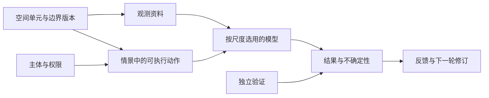

# 四级通用规划平台架构草案

状态：设计稿，未实现为跨海南计算系统。研究问题与科学关口见[路线二研究协议](ROUTE2_PROTOCOL.md)，术语见[领域词汇](../GLOSSARY.md)。当前网站的农场演示数据结构与区域证据审计保持分离。

## 先把四类“尺度”拆开

用户看到的农户、农场、村落、海南是**规划视角**，不是一条能自动汇总的空间树。每次操作同时声明四件事：

| 维度 | 示例 | 为什么要单独记录 |
|---|---|---|
| 地理覆盖 | 一户经营地、行政村、某市县、海南省 | 说明资料覆盖与结果可展示的范围 |
| 决策主体 | 农户、农场企业、自愿协作组织、公共部门 | 限制谁能改变什么；地理包含不授予经营权 |
| 观察粒度 | 农户—季节、市县—年份、气候网格—小时 | 防止把省级或网格值当作田块实测 |
| 模型适用域 | 已检验的农场类型、分区、时段及外部条件 | 防止直接转移虚拟农场参数或全岛阈值 |

市县、农业生态区与灌溉服务区可以重叠，也可与村落边界不同。海南是覆盖和汇总对象；省级公共部门若提出政策情景，也需登记自己的政策权限。

## 核心对象及关系

| 对象 | 必需身份与关系 | 设计要点 |
|---|---|---|
| `SpatialUnit` | 稳定 ID、类型、边界来源、有效期 | 行政区调整须有版本；地块预测边界不能冒充权属 |
| `Actor` | 稳定 ID、主体类型、可验证的权限 | 主体与空间单元多对多；可记录参与或退出 |
| `AdministrativeVillage` / `CollaborationGroup` | 各自独立 ID、成员和有效期 | 行政村与共享资源的小组概念分离 |
| `Activity` | 活动代码、计量单位、季节及投入产出定义 | 种植面积、畜禽头数、水产产量不强制用一种分母 |
| `ResourceFlow` | 来源、去向、资源类型、单位、时段 | 明确跨主体／跨区转移和边界内双计风险 |
| `Observation` | 值、单位、时间、空间支持范围、来源、身份 | 身份区分实测、统计、模型估计、假设和缺失 |
| `Scenario` | 外部条件、执行主体、动作、约束、决策时点 | 区分可控措施与降雨、价格等不可控状态 |
| `ModelRun` / `Outcome` | 输入、模型版本、适用域、指标与不确定性 | 结果必须可回溯到具体资料、参数和验证状态 |

其中 `V` 是独立资料或经营者检查，不能由模型得分自动生成。`SU` 可关联多个 `Actor`，同一 `Actor` 也可能经营多个 `SU`；资源设施和转移流另建关系。

## 各视角的共同流程与专属计算

所有视角共用“选范围 → 查证据 → 定义行动 → 检查权限和约束 → 核算／模拟 → 比较方案 → 记录反馈”。

| 视角 | 首个可实现的操作 | 更深的模型条件 |
|---|---|---|
| 农户 | 记录目标、劳动、现金和参与条件 | 有真实管理记录时比较个体可行方案 |
| 农场 | 当前演示工作台的活动与逐月资源核算 | 实际地块、投入产出与验证后替换演示参数 |
| 村落 | 显示主体及协作意愿、设施与共享规则 | 同意、权利和流量资料充分后模拟协作 |
| 海南 | 官方全省背景、数据审计与市县资料清单 | 市县时序与响应模型核验后做分区情景；省域只汇总 |

同一个前端页面可以切换视角，但计算器必须是带适用域声明的独立模块。农场核算器不通过更改地图边界就变成区域模型。跨尺度连接至少记录样本选择、活动定义、权重／覆盖范围和总量一致性检查。

## 从现有系统迁移的顺序

1. **保留现有农场项目格式。**当前 `villages` 只表示假设协作组，先在导出说明中明确；不直接重命名为真实行政村。
2. **建立独立的研究项目元数据。**先记录范围、主体、观测粒度、来源、模型适用域及情景定义；未填妥时不开放对应计算。
3. **接入真实村落及市县资料。**各有独立边界、年份、权限和质控状态；用关联表连接经营者与行政区。
4. **新增模型适配器。**农场、协作和区域模型分别声明输入、输出、时间步长、参数来源与验证结果；采用相同的活动和指标词汇。
5. **建立跨尺度结果检查。**任何向上汇总须标明覆盖率、权重、未覆盖主体与不确定性；任何向下展示须标明是原始资料还是模型估计。

## 必须维持的不变量

- 一个行动必须有执行主体、权限和可改变的时间窗。
- 一个指标必须有单位、空间与时间支持范围及来源身份。
- 省级统计与全岛文献阈值不得自动分配到市县或经营者。
- 便利选择的“典型农场”只提供机制与可行性线索；缺少可论证权重时不得报告全省平均效果。
- 结果导出要附带数据、参数、模型版本以及独立验证的状态。
