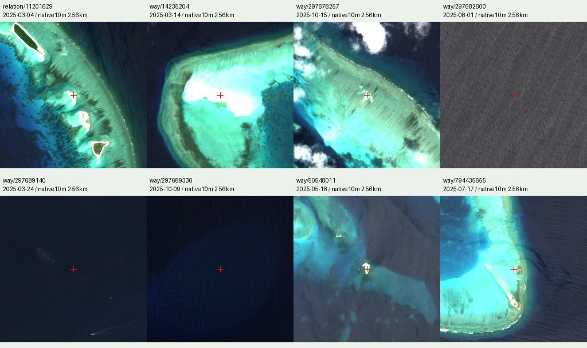

# 两处目录遗漏与七处质量缺口的定向核验

2026-10-03 · 只对9个明确对象补查2025日期。原522景不重复查询/读取；两处北部暗沙补独立小范围STAC检索，7处原质量拒绝对象复用已有全年STAC缓存。

新增8景、2个原始MGRS图幅，目录变为530景/172图幅。8个代表点取得非零RGB且通过界面同款原生SCL 7×7（横纵各扩3像元的方形邻域，像元中心距离60 m）云影规则；这只关闭具体点位的读值/选景缺口，不证明整个对象或海南全省已经完整覆盖。南岛额外检查12个候选仍未通过，保留质量缺口。

| 具名OSM对象 | 新读影像日期 | 中心SCL | 全景云量元数据 | 代表点结果 |
|---|---|---:|---:|---|
| [南岛](https://www.openstreetmap.org/relation/11201627) | 12个新增候选，详见JSON | — | — | 仍未通过质量规则 |
| [北沙洲](https://www.openstreetmap.org/relation/11201629) | [2025-03-04](https://earth-search.aws.element84.com/v1/collections/sentinel-2-c1-l2a/items/S2C_T49QFU_20250304T030435_L2A) | 6 | 19.711% | 非零RGB及60 m规则通过；RGB显示饱和 |
| [盘石屿](https://www.openstreetmap.org/way/14235204) | [2025-03-14](https://earth-search.aws.element84.com/v1/collections/sentinel-2-c1-l2a/items/S2C_T49PET_20250314T030340_L2A) | 6 | 6.111% | 非零RGB及60 m规则通过；RGB显示饱和 |
| [石屿](https://www.openstreetmap.org/way/297678257) | [2025-10-15](https://earth-search.aws.element84.com/v1/collections/sentinel-2-c1-l2a/items/S2B_T49QEU_20251015T031138_L2A) | 6 | 11.007% | 非零RGB及60 m规则通过；RGB显示饱和 |
| [西渡滩](https://www.openstreetmap.org/way/297682600) | [2025-08-01](https://earth-search.aws.element84.com/v1/collections/sentinel-2-c1-l2a/items/S2C_T49QFU_20250801T030622_L2A) | 6 | 6.901% | 非零RGB及60 m规则通过 |
| [神狐暗沙](https://www.openstreetmap.org/way/297689140) | [2025-03-24](https://earth-search.aws.element84.com/v1/collections/sentinel-2-c1-l2a/items/S2C_T49QGB_20250324T030806_L2A) | 6 | 0.965% | 非零RGB及60 m规则通过 |
| [一统暗沙](https://www.openstreetmap.org/way/297689336) | [2025-10-09](https://earth-search.aws.element84.com/v1/collections/sentinel-2-c1-l2a/items/S2A_T49QHB_20251009T025933_L2A) | 6 | 0.949% | 非零RGB及60 m规则通过 |
| [鸭公岛](https://www.openstreetmap.org/way/50548011) | [2025-05-18](https://earth-search.aws.element84.com/v1/collections/sentinel-2-c1-l2a/items/S2B_T49QEU_20250518T030841_L2A) | 5 | 13.380% | 非零RGB及60 m规则通过 |
| [筐仔北岛](https://www.openstreetmap.org/way/794435655) | [2025-07-17](https://earth-search.aws.element84.com/v1/collections/sentinel-2-c1-l2a/items/S2B_T49QEU_20250717T030848_L2A) | 6 | 8.450% | 非零RGB及60 m规则通过 |

SCL6表示水体类别，SCL5表示来源分类中的非植被。非零或饱和RGB不能推断露出陆地、作物、权属或清晰程度。全景云量也不是这个点的云概率。实际原生RGB快视中，若干饱和点对应明亮礁沙或浅滩；两处暗沙和西渡滩显示海面；石屿邻近仍有云团。视觉核看只作局部佐证，不提供无云保证。

8个源窗口各256×256原生10 m像元，约2.56 km见方，红十字标记抽样位置。每块使用自己的2025日期，拼板不是同日无缝影像，也不是面积统计。Contains modified Copernicus Sentinel data (2025), Earth Search / Element 84 public COG.

新增scene仅在与对应小查询窗相交的显示瓦片中优先尝试；每个输出像元仍须独立通过原来的SCL规则，不能把查询矩形填成“已核全覆盖”。其他位置仍按原云量/无值评分排序，原12源上限和无值透明语义保留。

完整记录：[targeted-audit.json](../data/hainan/regional/coverage/targeted-audit.json)；[实际快视来源记录](../data/hainan/regional/coverage/targeted-visual-evidence.json)。原始STAC快照、每次读值和失败尝试保存在本轮复现资料中。

2个无效OSM礁盘关系（中建岛relation11169306、珊瑚岛礁盘relation19122386）仍按无效保留；未补画或自动修面，不能与同名有效海岸对象混同。完整去重岛礿名录、官方现势界和按岛统计分母的缺口仍未解决。
